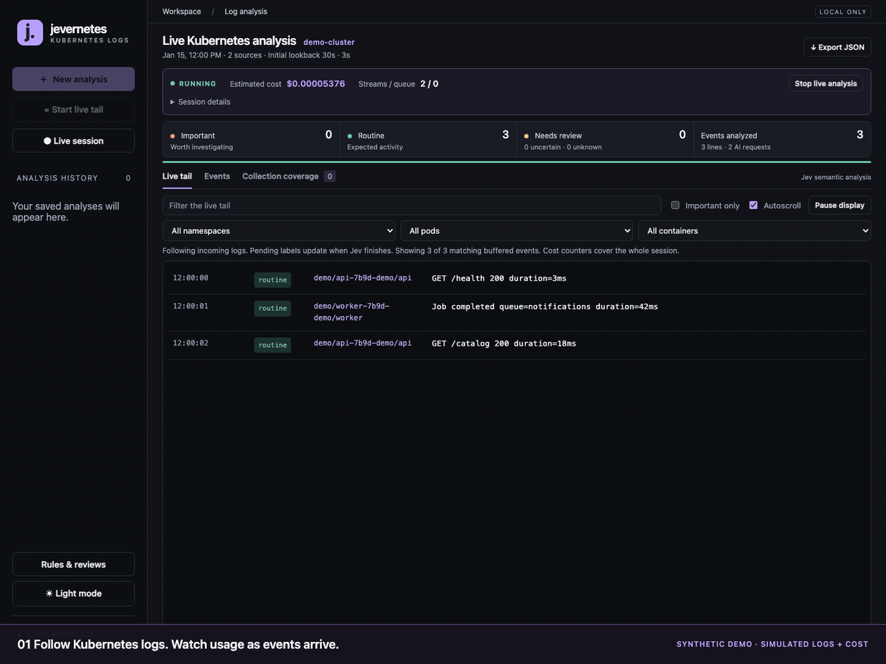

# jevernetes

Live log analysis and incident investigation for Kubernetes clusters, powered by [TypeSafe Jev](https://docs.typesafe.ai). Follow pod logs across namespaces, identify events worth investigating, inspect surrounding context, and track estimated AI costs in a terminal or local dashboard.

- Live `kubectl` collection for normal, init and ephemeral containers.
- Context views with namespace, pod, container and text filters.
- Acknowledgments and scoped rules for expected events.
- Token usage and estimated cost tracking with configurable session limits.
- Local dashboard with dark/light themes; offline keyword analysis without an API key.
- File and archived-log analysis as a companion workflow.

Apache 2.0 licensed. Inspired by [Log Sentinel](https://github.com/dabit3/jev-experiments/tree/main/log-sentinel).

An ERROR whose retry succeeded can be routine. An INFO message saying a backup wrote zero bytes can be important. Jev judges the meaning; a separate keyword baseline lets you compare its decisions. This is a Python 3.11+ terminal tool and local browser dashboard with no runtime dependencies.



Live tail → select important events → copy a prompt for Claude, Codex, or another coding agent. Recorded with synthetic logs and simulated classifications and cost counters; no real cluster data. [Recreate the demo](docs/demo.md).

## Quick start

Using Claude, Codex, or another coding agent? Paste this prompt:

```text
Set up https://github.com/sunil-sadasivan/jevernetes locally. Check that Python
3.11+ and kubectl are available, show me my current Kubernetes context, and
launch the local dashboard. Help me start a read-only live tail in offline
mode first, then explain how to enable Jev analysis and set a cost threshold.
Never commit API keys, kubeconfigs, logs, or reports.
```

Or follow the steps below yourself.

Requirements: Python 3.11 or newer, `kubectl` on your PATH, and a kubeconfig that can access your cluster. The analyzer uses the same authentication as `kubectl`, including `KUBECONFIG` and credential plugins. No cloud-provider-specific tooling is required beyond what your kubeconfig already uses.

Clone the repository and enter the project directory:

```sh
git clone https://github.com/sunil-sadasivan/jevernetes.git
cd jevernetes
```

Then run:

```sh
# Confirm your selected cluster and permission to discover pods.
kubectl config current-context
kubectl get pods --all-namespaces

# Try local keyword analysis without an API key.
./jevernetes k8s -f --tail 0 --offline

# For Jev semantic analysis, set your own TypeSafe API key.
export TYPESAFE_API_KEY='your-api-key'
./jevernetes k8s -f --tail 0

# Or launch the local dashboard.
./jevernetes dashboard
```

All namespaces are selected by default. You need permission to list pods and read pod logs in the selected scope. Use `--namespace my-namespace` if you only have access to one namespace, or `--context my-cluster` to select a different configured context. For file analysis, Kubernetes and `kubectl` are not required.

## Local dashboard

```sh
./jevernetes dashboard
# Or: python3 -m jev_log_analyzer dashboard --port 8792 --reports-dir .runs
```

Open **http://127.0.0.1:8792**. The dashboard loads existing JSON reports from `.runs` and selects the newest one. It includes:

- History, importance counts, searchable events and source/importance filters.
- Event details, model confidence, severity, category, original line ranges and the keyword baseline.
- A coverage view showing unavailable logs, truncation and collection gaps.
- New Kubernetes scans using the current context or a specified context, namespace, label selector and time window.
- File uploads for text, JSONL and gzip, with Jev or offline analysis.
- Background scan progress, explicit errors and downloadable JSON reports.

One analysis runs at a time. Keep the terminal running; stopping the server interrupts active analysis. Uploads are limited to 20 files and 10 MiB total, stored temporarily during analysis and removed afterward. Reports use the uploaded filenames rather than temporary paths, are saved with mode 0600, and persist in the reports directory. The dashboard lists up to 100 recent reports, at most 64 MiB per report; use the CLI for larger inputs/reports. No sample data is generated automatically.

The server binds only to `127.0.0.1`. Host validation and a per-session request token protect analysis requests, and log content is rendered as text. Provider credentials remain on the server. The Jev key must be in the environment when starting the dashboard; the browser never accepts or receives it. There is no remote hosting, login system, or automatic cluster scan on startup.

## Live Kubernetes analysis and cost

For a `tail -f` experience, click **Start live tail** in the sidebar. This defaults to new lines only (`--tail 0`), opens the **Live tail** tab, and shows all arriving events in order before analysis completes. Pending labels update in place when Jev finishes. Use autoscroll, text filtering, **Important only**, or **Pause display** to inspect the stream. Pausing the display does not stop collection, classification, or costs; **Stop live analysis** stops the session. The tail shows the latest 300 matching buffered events. Queue-overflow events appear as `dropped`, not as analyzed judgments.

```sh
./jevernetes k8s -f --tail 0
```

`-f`, `--follow`, and `--live` are equivalent. The terminal prints incoming redacted log text to stdout once, and counters/later classification updates to stderr. With `--tail 0`, streams start with lines emitted after each container is attached; set `--tail 100` to include recent history. `--json` continues to emit report snapshots, now including `tail_events` with arrival sequences and pending/final labels. Arrival order is the collector's observed order, not a globally synchronized cluster clock. Display-buffer gaps are reported in terminal output.

In the dashboard choose **New analysis → Kubernetes → Follow new logs continuously**. Results and the cost panel refresh every second. **Stop live analysis** stops collection, finishes/cancels in-flight work and saves a session report. You can browse older reports while a session runs and return with **Live session**.

```sh
./jevernetes k8s --live \
  --since 30s --tail 100 --max-batches 5000 --max-cost 0.25 \
  --output .runs/live-session.json

# Bounded local-only collection check
./jevernetes k8s --live --offline --duration 60 --since 30s
```

Live mode uses `kubectl logs --follow` for running normal, init and ephemeral containers. It rediscovers pods every 15 seconds and identifies container instances by pod UID, container name and restart count. Reconnects resume from the last timestamp and skip already-seen occurrences at that timestamp. This is best-effort continuity: rotations, terminated containers between discovery cycles and removed pods can still lose logs. Use the snapshot command without `--live` to inspect retained previous-container logs.

Events are grouped with a 500 ms idle flush for stack traces and sent in batches of up to 8 with a 350 ms linger. The display refresh adds up to a second, plus provider and queue latency. Stack continuations arriving after the idle flush can form separate events. This is live collection with periodic dashboard refresh, not a hard latency guarantee.

The panel shows session cost, input/output tokens, request attempts (including retries), unmetered attempts, open streams, queue depth, events/second, reconnects and dropped events. Session counters cover all processed events; the browser displays the latest 1,000, and the saved report retains the latest 2,000 by default. Older event text is evicted, but its counts and cost remain. `--retain-events` changes retention. Reports are saved on stop; process crashes do not persist an unfinished session.

Cost uses the API's actual `usage.input_tokens` and `usage.output_tokens`, multiplied by the configured price. The default direct-TypeSafe rate, verified September 20, 2026, is **$0.042 per million input tokens and $0 for output**, from the [official model reference](https://docs.typesafe.ai/models). The [API reference](https://docs.typesafe.ai/api) documents the usage fields. `--input-price` and `--output-price` override USD per million tokens in live CLI mode. The result is a model-cost estimate, not an invoice; it excludes taxes and infrastructure. Old reports without recorded usage show no cost panel.

Requests lacking valid usage (including failed attempts) are explicitly counted as unmetered; their cost is unknown, not assumed free. A usage-bearing response with invalid classifications still contributes its reported tokens. `--max-cost` defaults to $0.25 and stops after the measured estimate reaches that threshold. **It is not a strict spending cap:** concurrently in-flight requests, delayed usage and unmetered failures can exceed it. The independent `--max-batches` budget bounds batches (up to 3 HTTP attempts each); its default remains 500. Offline mode issues no Jev requests.

Resource bounds: up to 128 stream subprocesses, a 2,000-event queue and 4 classification workers by default. `--max-streams` (at most 256), `--queue-size`, and `--workers` adjust these. When the queue fills, newly arriving events are dropped and counted visibly; when the stream cap is reached, uncollected running containers are counted. No claim of complete cluster coverage is made. A scan cannot run concurrently with a live session. Stopping can take up to the outstanding inventory/API timeout to clean up.

### If live tail has no streams

Live pod inventory has a 12-second timeout. Both the terminal and dashboard show the current attempt and the error category (DNS, TCP timeout, TLS, authentication or RBAC), with a retry every 15 seconds. An inventory failure is a coverage gap, not a collected source; the source count remains zero. The terminal suppresses identical status messages except for a 10-second heartbeat.

Check a **new** request in the same terminal where you launch the analyzer:

```sh
kubectl config current-context
kubectl --request-timeout=8s get --raw=/version
kubectl --request-timeout=8s get pods -A
```

If an existing log tail works but fresh requests time out, compare the context, kubeconfig, VPN/network path and provider control-plane firewall. Existing connections can behave differently from new connections after firewall changes. The analyzer does not modify firewall rules or kubeconfig. A forbidden response instead indicates missing pod-list or pod-log permissions; successful logs in one namespace do not necessarily imply permission to list all namespaces.

## Start with all Kubernetes logs

Run from this directory. Set `TYPESAFE_API_KEY` for Jev analysis; `TYPESAFEAI_API_KEY` and `TYPESAFE_API_KEY_FILE` (a file containing only the key) are also supported. Credentials stay in the process and are not written into reports.

```sh
python3 -m jev_log_analyzer kubernetes \
  --since 1h --tail 500 \
  --output .runs/kubernetes.json
```

Without `--context`, the current kubectl context is resolved once and pinned for the scan. All namespaces are included by default. Collection uses your existing kubectl authentication and read permissions. No cluster resources are modified or installed.

The scan enumerates every visible pod, including normal, init and ephemeral containers, and requests the previous instance when a container has restarted. Unavailable logs, pending containers, RBAC errors and timeouts appear in `coverage`. It reads up to 500 lines from the last hour, at most 2 MiB per stream by default. This is a snapshot of logs retained by Kubernetes, not every historical log: rotated/deleted pods and older container instances require an external log archive. The byte/tail caps and any detected omissions are reported.

```sh
# Larger cluster/window: raise the collection and AI budgets explicitly.
python3 -m jev_log_analyzer k8s --since 6h --tail 2000 \
  --max-events 100000 --max-batches 12500 --output .runs/cluster.json

# Narrow investigation
python3 -m jev_log_analyzer k8s -n my-namespace -l app=my-app --since 30m

# Local rules only: no calls to Jev
python3 -m jev_log_analyzer k8s --offline --output .runs/offline.json
```

## Analyze files

```sh
python3 -m jev_log_analyzer files examples/mixed.log
python3 -m jev_log_analyzer files /path/app.log /path/worker.log.gz \
  --output .runs/files.json
cat /path/app.log | python3 -m jev_log_analyzer files - --json
```

Plain text, JSONL, gzip and stdin work without configuration. Parsing is limited to 32 MiB of decompressed input per file or stdin; `--max-file-bytes` changes the CLI limit. The limit also covers blank and oversized lines, and partial coverage is reported. Common Java/JavaScript/Python stack trace continuations are grouped into one event; the original line range is preserved. Grouping is heuristic, not a parser for every log format. Each event includes redacted text, source, timestamp when recognized, line range, local baseline and Jev results. Repeated important messages are grouped by exact text and source; unrelated incidents are not merged solely because they share a category.

Optional install in a virtual environment provides the `jevernetes` command:

```sh
python3 -m venv .venv
.venv/bin/pip install .
.venv/bin/jevernetes --help
```

## Investigate events in context

Open any event in **Events** or **Live tail**, then choose **View in context**. The selected event stays pinned and highlighted while you inspect surrounding lines, including routine and unclassified events. Filter by namespace, pod, container or message text. The same source filters are available in the main events list and live tail.

The initial context is a frozen view of collected events. Kubernetes windows range from 30 seconds to 15 minutes on either side; files and events without timestamps use surrounding line numbers. **Fetch from Kubernetes** reads additional retained logs for the selected event's container using its recorded context. Other pods in the context view use already-collected events. Fetching does not send logs to Jev or add AI charges. It is bounded to 1 MiB and 2,000 parsed events, displaying up to the nearest 500 events. Pod replacement, unavailable prior instances, rotation, truncation and missing logs are reported. Uploaded files are not reread after analysis; their context comes from the retained report.

## Hand selected events to a coding agent

In **Important**, **Needs review**, or any Events filter, use the row checkboxes to select log events. **Select page** selects the visible page; selections remain available across pages and filters within the report. **Copy investigation prompt** creates a prompt you can paste into Codex or another coding agent. It includes only the selected events, recorded source metadata, timestamps, judgments, baseline signals and full retained event text. **Preview** lets you inspect it first, and manual copying is available if the browser blocks clipboard access.

The prompt asks the agent to investigate, correlate evidence, propose a minimal fix and test appropriate code changes. It treats logs as untrusted data and asks for explicit authorization before deployments or infrastructure changes. Copying is local and makes no AI requests. Select up to 50 events, within a 256 KiB prompt limit; oversized selections produce an error rather than silently truncating evidence. Selections are snapshots of events at selection time and reset when switching reports. Review the prompt for personal or sensitive data before sharing it.

## Review expected events and inspect rules

From an event's detail dialog:

- **Acknowledge** removes that event from the important queue. It applies only to that event in that report or live session, and can be undone.
- **Mark as expected** opens an editable literal message pattern. Choose a stable substring without timestamps or request-specific values. The default Kubernetes scope is the same cluster, namespace and container across pod replacements; exact-pod scope is also available. File rules use the exact source path/name.

Future matching events remain visible as **Expected** and skip AI analysis. Existing retained matches leave the important queue, with their original judgment preserved for inspection. **Expected** and **Acknowledged** filters let you find reviewed events. These are local overrides, not model training. Disabling an expected rule restores existing judgments; events that skipped analysis become unknown and are not automatically sent to Jev retrospectively.

Open **Rules & reviews** in the sidebar to inspect or disable expected-event rules and inspect the exact built-in keyword baseline expressions. The baseline is read-only and independent of Jev semantic judgments. Expected rules take precedence over either analysis mode. Rules are shared with the terminal through `.runs/.review-rules.json`; `--rules-file PATH` selects another file for CLI analysis. A dashboard using `--reports-dir` stores rules in that directory. Rules are private runtime data, saved with mode 0600, excluded from version control and source distributions. Live counters apply review changes to retained events; already-evicted history cannot be reviewed retroactively.

## Appearance and command name

**jevernetes** defaults to dark mode. Use **Light mode** or **Dark mode** in the sidebar; your browser remembers the selection on this computer. The `jevernetes` command is the primary entry point. The earlier `jev-ernetes` and `jev-log-analyzer` commands and `python3 -m jev_log_analyzer` remain compatible.

## Judgments and budgets

Jev receives three typed Choice questions for each event: importance (`important`, `routine`, `uncertain`), severity, and category. Each answer has a model confidence. Low-confidence routine answers and truncated events become uncertain. API failures, missing/invalid answers and events beyond the AI budget become `unknown`; they never become routine by default. These confidence values are model outputs, not independently calibrated probabilities.

By default, up to 8 events are batched into each request, with 4 concurrent requests and a 500-batch budget (4,000 events). In snapshot mode, all collected events remain in the report even when the budget runs out. `--max-batches`, `--batch-size`, `--workers`, and `--max-events` control cost and load. HTTP 429 and transient server errors use a shared cooldown, with at most 3 attempts per batch. Requests have a 30-second timeout. Re-running a snapshot reclassifies its events; there is no persistent cross-session cache. Live mode has the retention and stop behavior described above.

`--offline` is explicitly a keyword baseline, not semantic analysis: matching events are important, unmatched events are uncertain. It does not claim ordinary-looking lines are safe.

## Output and exit codes

- Default: terminal summary and top 15 groups of important events (`--top N` to change).
- `--output PATH`: complete JSON report, atomically replaced with file mode 0600.
- `--json`: the same report to stdout; progress goes to stderr.
- `0`: scan completed within its selected limits; this does **not** mean nothing important was found.
- `1`: configuration, inventory or fatal execution failure.
- `2`: partial coverage or at least one unknown/unclassified event. The report is still saved.
- `130`: interrupted.

Inspect `summary`, `important_groups`, `coverage`, and `events`. `complete_within_window` means there were no detected collection gaps or unclassified events; it does not assert perfect detection or availability of all historical logs. An `uncertain` result needs human judgment.

## Data handling

Jev mode sends **redacted log text and source metadata to TypeSafe** over HTTPS. Redaction covers common credential fields, bearer/basic authorization, JWTs and URL passwords, including nested JSON fields. It is best effort: arbitrary personal data or secrets embedded in unfamiliar formats may remain. Use `--offline` when logs must stay local. Saved reports contain log evidence, context/namespace/pod names and file paths; keep them outside version control. `.runs/` and `reports/` are ignored and excluded from source distributions. Only synthetic log fixtures are included with this project. Terminal output strips control bytes.

The analyzer has no remediation tools, arbitrary command execution based on logs, or cluster write operations. Log text is treated as untrusted data in the prompts. Model classification is advisory and can miss issues or flag benign activity.

## Development

GitHub CI includes Dependabot updates, TruffleHog secret scanning, Bandit, pip-audit, and CodeQL for Python and JavaScript. See [CONTRIBUTING.md](CONTRIBUTING.md) for scanner settings and local checks.

```sh
python3 -m unittest discover -s tests -v
python3 -m compileall -q jev_log_analyzer
node tests/test_context_ui.cjs
node tests/test_prompt_ui.cjs
```

Tests cover multiline grouping, caps, redaction, invalid model answers, API failures, budget exhaustion, Kubernetes container coverage, previous logs, partial failures, report permissions and the CLI. Live synthetic checks are recorded in [VALIDATION.md](VALIDATION.md).

## License and security

Licensed under [Apache 2.0](LICENSE). See [SECURITY.md](SECURITY.md) for the trust model, data handling, and private vulnerability reporting, and [CONTRIBUTING.md](CONTRIBUTING.md) for development checks.
