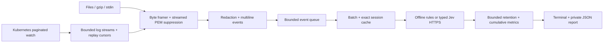

# Rust runtime architecture

The first migration deliverable is one Cargo package with a reusable library and the production `jevernetes` CLI. Modules provide boundaries without introducing separately versioned internal crates:

| Module | Responsibility |
| --- | --- |
| `events` | Typed event/source model, incremental byte framing, PEM state, redaction, timestamps, multiline assembly, deterministic IDs, offline rules |
| `jev` | System One request construction, typed choice decoding, conservative confidence handling, HTTPS policy, retries and usage accounting |
| `grouping` | Exact source/message fingerprints and bounded five-minute LRU of successful judgments |
| `kubernetes` | Read-only paginated inventory/watch, instance discovery, snapshot/log streams, reconnect cursors and cancellation |
| `runtime` | Bounded queue, batching, one analysis lane, intra-batch sharing, retention and loss accounting |
| `report` | Cumulative counters, bounded coverage/event history, schema 2 projection and atomic private writes |
| binary `main` | CLI validation, input selection, credentials at runtime, signals, output and exit codes |

The source includes Kubernetes cluster identity, namespace, pod UID, container kind/name, restart count and previous/current instance. Cluster identity combines the selected/inferred context label and a hash of the API URL; endpoint text is not printed. The collector validates the UID/restart before opening logs. Kubernetes addresses logs by pod name, so a change between identity check and stream opening remains a race; watch updates retire replaced instances. There is no claim of transactional log/identity binding.

## Performance model

Tokio schedules one task per active log stream, one discovery task and one analysis consumer. An idle stream awaits I/O. A 500 ms timer exists only while a parsed event is pending; live status ticks every ten seconds, discovery resyncs every five minutes, and failures back off. There is no thread or subprocess per container and no `kubectl` polling loop. The [kube-rs watcher](https://docs.rs/kube-runtime/4.2.0/kube_runtime/watcher/fn.watcher.html) recovers watch interruptions; explicit error backoff prevents hot retries. [Paginated initial lists](https://docs.rs/kube/4.2.0/kube/runtime/watcher/struct.Config.html) use 50 pods per page, and the application retains only active targets, not an all-pod reflector cache.

Application payload memory is approximately `O(streams × (line + pending event + cursor) + queue × event + retention × event + batch × event + cache entries)`, plus a 50-pod discovery page, transport buffers and report serialization. Default caps are 64 streams, 64 KiB line, 16,000-byte event, 4,096 distinct cursor hashes per stream, 1,024 queue events, 2,000 retained live events, batch 8 and 500 coverage records. A snapshot retains at most 100,000 events by default; lower `--max-events` for small-memory jobs. User-selected very large caps can consume substantial memory. Source metadata and pod responses remain subject to Kubernetes transport/server object limits; these application bounds are not a byte-perfect process RSS cap. JSON projection temporarily clones retained evidence. No claim of measured low RSS or throughput is made yet.

A single provider lane makes in-flight work, shared retry cooldown, cache ownership and spending easy to bound. It intentionally defers the legacy four-request/parallel-snapshot throughput tuning. Files/snapshots await queue capacity. Live ingestion uses explicit drop-on-full to avoid blocking all discovery/ingestion behind slow model requests; cumulative counters expose loss. Dropped events have no retained payload. The only retained classification history is the bounded window; counters cover the full process lifetime.

## Security and trust

Redaction precedes event storage, report generation and provider submission. Incremental PEM scanning includes discarded oversized-line tails and markers split across transport chunks; state persists across log reconnects. Common fields, nested JSON secrets, escaped values, bearer/basic values, URL passwords and JWT shapes are scrubbed. Redaction remains best effort, particularly for arbitrary personal data, unusual encodings and source metadata. Event IDs hash redacted content rather than retaining raw credentials. Raw bytes and hashes exist transiently for framing/replay; no raw-log spool is written.

Jev receives structured evidence and explicit untrusted-data instructions on every choice question. `fraud` adds evidence-based payment/account abuse classification without giving the model tools, remediation permissions, or additional network destinations. Numeric confidence is finite and within [0,1]; enums, question identity, answer count and required fields are checked. Unknown or failed judgments cannot enter the reuse cache. The model's confidence is not an independently calibrated probability.

The provider URL is fixed; TLS verification is enabled, redirects disabled, header values marked sensitive, requests timed out, response bodies bounded. Errors expose only controlled messages/status numbers. Provider keys are not CLI arguments, report fields or debug-printable client fields. Existing kubeconfig and authentication plugins are trusted local configuration; the Rust runtime reads them only when Kubernetes collection is explicitly invoked. It uses no cluster mutation methods and needs no Secret read access. Offline files never initialize a Kubernetes/provider client.

Reports use atomic replacement and private Unix permissions. There is no dashboard listener in Rust. The legacy loopback server keeps its existing Host/Origin/token controls and remains local-only. Rust schema 2 does not imply legacy report-import compatibility. Security automation for that code is retained.

## Recovery and coverage

Log replay requests `sinceTime` inclusively and suppresses only the counted copies of each raw-line fingerprint at the cursor timestamp. Later identical occurrences remain evidence. Timestamp comparison normalizes RFC3339 offsets/nanoseconds. Older replay lines are skipped. Untimestamped lines and truncated/cursor-overflow lines favor retention over suppression, with counters for uncertainty. Out-of-order timestamps may be skipped; reconnects/rotation/retention are explicitly partial. This is a session cursor, not durable exactly-once ingestion.

Shutdown cancels producers, flushes pending events, joins stream tasks, drains the queue and writes a final report. Queue drops, limits, read failures, discovery failures, reconnects, omitted streams and coverage-history eviction remain visible. Cancellation during a provider request records unmetered usage because billing may already have occurred. A process crash can lose all in-memory state. No durable controller, WAL, reconciliation policy, multi-replica coordination, probabilistic state machine or product-opportunity design is included in this phase.

## Benchmarks and operational validation still needed

Measure release-build parser throughput and allocation rates with ASCII/Unicode, multiline, oversized, secret-rich and gzip inputs; compare the Python baseline using identical synthetic corpora. Measure idle CPU/RSS and burst RSS across 1/64/1,000 streams, queue saturation/drop recovery, 50-pod listing pages and watch relists across large synthetic inventories. Measure Jev latency/cost/reuse under controlled repeated/unique traffic and determine whether bounded concurrent lanes improve throughput. Exercise an explicitly authorized disposable cluster for RBAC denial, pod UID/restart races, rotation, half-open connections, watch expiration, service-account token rotation and SIGTERM grace periods. No live cluster, real logs, provider credentials or billing calls are needed by the automated tests; none establishes real-cluster production readiness.
