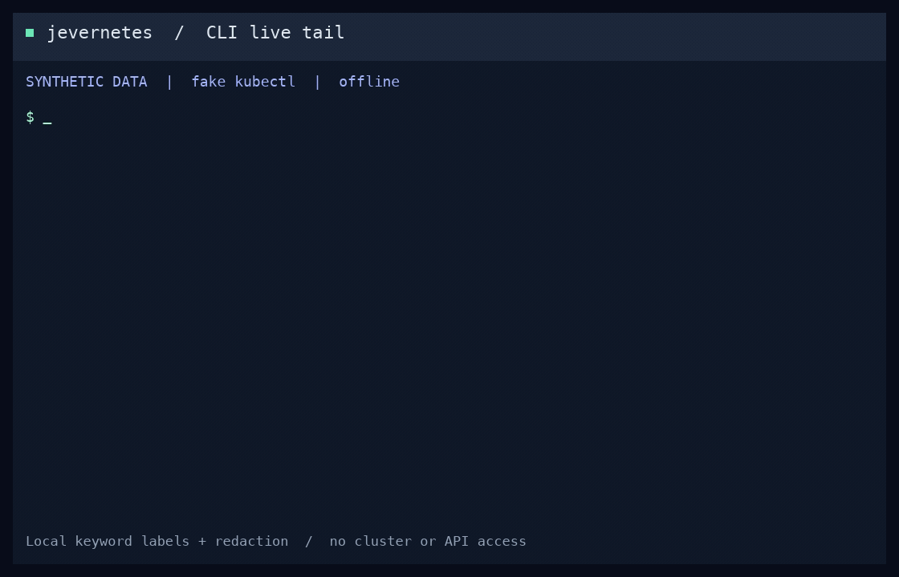

> Legacy Python companion. Rust is the default runtime; see [migration status](migration.md).

# jevernetes

Kubernetes logs can feel like a haystack. Operators often don't know whether there are needles to find until it's too late. **Jevernetes helps surface the logs worth investigating.**

Live Kubernetes log analysis in your terminal or a local dashboard, powered by [TypeSafe Jev](https://docs.typesafe.ai). Ask questions to find matching logs, inspect their context, and hand selected evidence to your coding agent.


Live tail → select errors → copy an agent prompt → acknowledge or mark expected.

## Quick start

Using Claude, Codex, or another coding agent? Paste this prompt:

```text
Set up https://github.com/sunil-sadasivan/jevernetes locally. Check that Python
3.11+ and kubectl are available, show me my current Kubernetes context, and
launch the local dashboard. Help me start a read-only live tail in offline
mode first, then explain how to enable Jev analysis and set a cost threshold.
Never commit API keys, kubeconfigs, logs, or reports.
```

Or set it up yourself. You need **Python 3.11+**, **kubectl**, and permission to list pods and read logs. No Python runtime dependencies are required.

```sh
git clone https://github.com/sunil-sadasivan/jevernetes.git
cd jevernetes

# Check your cluster access.
kubectl config current-context
kubectl get pods --all-namespaces

# Optional: enable Jev semantic analysis before starting the dashboard.
export TYPESAFE_API_KEY='your-api-key'

python3 -m jevernetes dashboard
```

Open **http://127.0.0.1:8792** and click **Start live tail**. Without an API key, choose **Offline keyword rules**. Keep the terminal running while using the dashboard.

Collection uses your existing kubectl configuration and is read-only. All namespaces are included by default; use `--namespace my-namespace` or `--context my-cluster` to narrow the scope.

## Investigate in the dashboard

- **Live tail:** follow incoming logs, filter by pod or text, and watch token usage and estimated cost.
- **Confidence:** highlight and filter confidence levels, with highest-confidence judgments surfaced first and browser preferences remembered.
- **Log groups:** repeated messages reuse Jev judgments. Select groups to review all matching instances, or open a group to inspect individual occurrences.
- **Ask Jev / Find logs:** ask questions such as “major issue with db,” or find requests involving an IP address. Jev semantic search finds matching groups, with every instance available to inspect.
- **View in context:** inspect surrounding lines and fetch additional retained logs from Kubernetes.
- **Copy investigation prompt:** select rows in Important or Needs review, then copy their evidence into Claude, Codex, or another agent.
- **Acknowledge / Mark as expected:** review one event or a selection, and suppress future expected matches. Inspect and manage rules in **Rules & reviews**.

Dark mode is the default; light mode is one click away. Reports and review rules are saved locally in `.runs/`.

Watch the [semantic log search demo](images/search-demo.gif) or download the [MP4](images/search-demo.mp4). The demo uses synthetic logs and illustrative results.

## Terminal usage

See [terminal tabs and semantic search in action](images/terminal-search-demo.gif) ([MP4](images/terminal-search-demo.mp4)). The demo uses the actual terminal renderer with synthetic logs and Jev results.



```sh
# Follow new logs using local keyword rules, without an API key.
python3 -m jevernetes k8s -f --tail 0 --offline

# Interactive terminal: clickable filters; / asks Jev, f finds exact text.
python3 -m jevernetes k8s -f --tail 0 --offline --tui

# Live Jev analysis with an AI batch budget and estimated cost threshold.
python3 -m jevernetes k8s -f --tail 100 --max-batches 5000 --max-cost 0.25

# Analyze a snapshot of the last hour.
python3 -m jevernetes k8s --since 1h --output .runs/cluster.json

# Try a local log file without an API key.
python3 -m jevernetes files examples/mixed.log --offline
```

Jev analysis requires `TYPESAFE_API_KEY`. Cost is an estimate; in-flight requests and missing usage can exceed the stop threshold. Check **Collection coverage** for missing or truncated logs.

See the [usage reference](legacy-usage.md) for installation, filters, budgets, troubleshooting, file inputs, and exit codes. Run `python3 -m jevernetes --help` for commands.

## Data and security

Jev mode sends redacted log text and source metadata to TypeSafe. Redaction is best effort; use `--offline` when logs must stay local, and review copied prompts before sharing. The dashboard binds to localhost. Keep logs, reports, kubeconfigs, and API keys out of version control.

[Security policy](../SECURITY.md) · [Contributing and CI checks](../CONTRIBUTING.md) · [Validation](../VALIDATION.md)

Licensed under [Apache 2.0](LICENSE). Inspired by [Log Sentinel](https://github.com/dabit3/jev-experiments/tree/main/log-sentinel).
